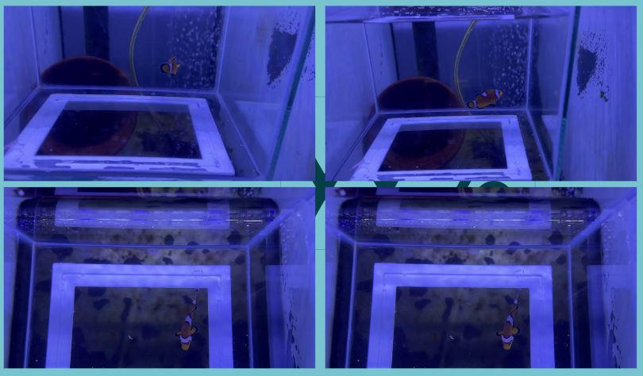
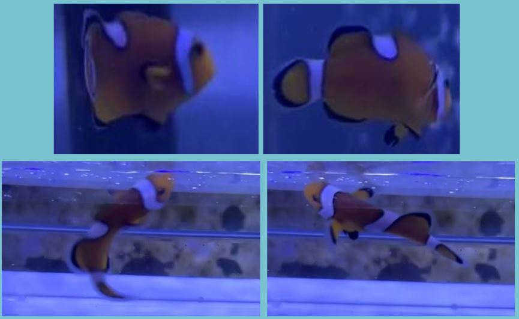
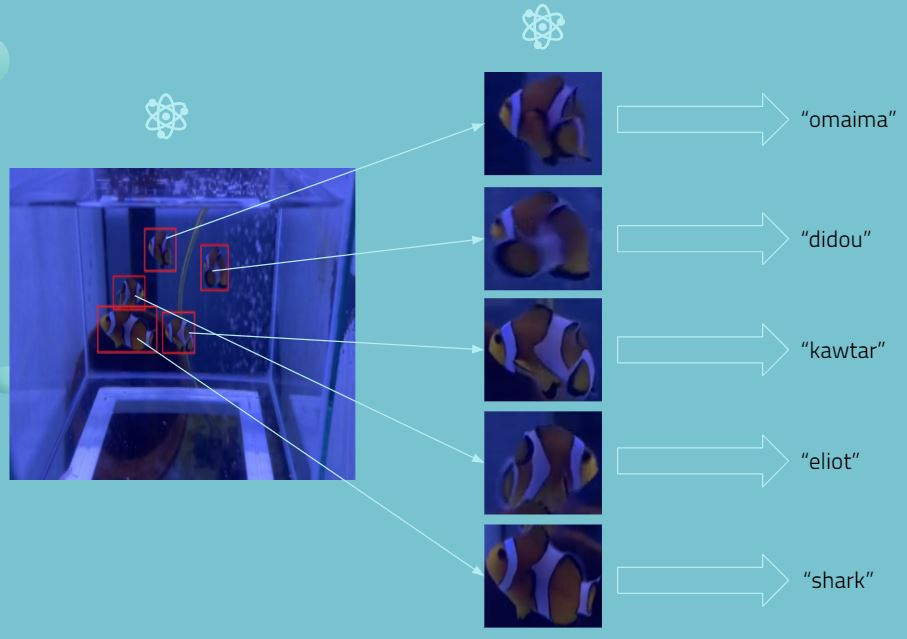

# biodiversarium_poisson_clown

## Objectif : Déterminer si il est est possible d'identifier un poisson-clown en tant qu'individu ?

## Protocole 1

Dataset : 1000/classes, images non optimales (cadre sur l'aquarium & autres objets autres que le poisson).
Architecture : (16, 32) -> 32 -> 6
Resultats : Arrive à identifier le poisson-clown noir mais confond les autres poissons.

## Protocole 2

Dataset : ~2000/classes, images recardrées sur le poisson & augmentation du nombre d'images.
Architecture : (16, 32) -> 32 -> 32 -> 6
Resultats : Réseau légèrement plus précis, arrive à identifier le poisson avec le defaut sur la bande & le poisson-clown noir mais confond encore les autres poissons.

## Protocole 3

Dataset : 5000 - 10 000/classes, bien préparer les données (recardrer les images et avoir des images prise de manière optimales, etc..).
Architecture : Diminuer les convolutions pour garder plus de details.
Combiner 2 réseau :
- réseau 1 => (détection yolo) -> image du poisson
- réseau 2 => (classification) -> nom de l'individu

# Auteurs :
- [KAWTAR SETTAR](https://www.linkedin.com/in/kawtar-settar-824696195/)
- [OMAIMA MADMOURH](https://www.linkedin.com/in/omaima-madmourh-a71b2a194/)
- [BEN HASSEN Douraïd](https://www.linkedin.com/in/doura%C3%AFd-ben-hassen/)
- [Eliot MARECHAL]()
